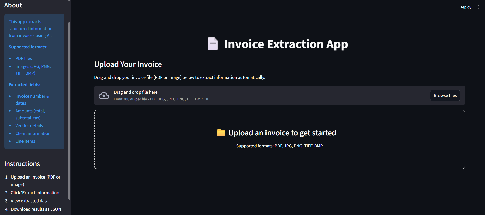

# Invoice Extraction App

A powerful and intelligent invoice processing application that automatically extracts structured information from invoices using AI and OCR technologies. Built with Streamlit and Groq API, this tool can handle both PDF and image-based invoices with high accuracy.



## 🌟 Features

- **Multi-Format Support**: Process both PDF and image invoices (JPG, PNG, TIFF, BMP)
- **AI-Powered Extraction**: Utilizes Groq's Mixtral model for accurate data extraction
- **Structured Data Output**: Extracts key invoice fields into organized JSON format
- **User-Friendly Interface**: Clean Streamlit web interface with real-time preview
- **Batch Processing Ready**: Easily process multiple invoices
- **Export Capabilities**: Download extracted data as JSON files

## 📋 Extracted Information

The application extracts the following structured data from invoices:

- **Basic Information**: Invoice number, date, due date
- **Financial Details**: Total amount, subtotal, tax amount
- **Vendor Details**: Name, address, email, phone number
- **Client Information**: Name and address
- **Line Items**: Detailed list of products/services with quantities and prices

## 🚀 Quick Start

### Prerequisites

- Python 3.8 or higher
- Groq API key ([Get one here](https://console.groq.com))
- Tesseract OCR installed on your system
- Poppler installed on your system

### Installation

1. **Clone or download the project files**
```bash
   git clone <repository-url>
   cd InvoiceExtraction
   ```

2. **Install required packages:**
```bash
pip install -r requirements.txt
```

3. **Install Tesseract OCR:**
   - **Windows**: Download from [UB-Mannheim/tesseract](https://github.com/UB-Mannheim/tesseract/wiki)
   - **macOS**: `brew install tesseract`
   - **Linux**: `sudo apt-get install tesseract-ocr`

4. **Install Poppler (for PDF processing):**
   - **Windows**: Download from [poppler-windows](https://github.com/oschwartz10612/poppler-windows/releases/)
   - **macOS**: `brew install poppler`
   - **Linux**: `sudo apt-get install poppler-utils`

5. **Set up environment variables:**
   Create a `.env` file in the project root:
```env
GROQ_API_KEY=your_groq_api_key_here
```

### Running the Application

```bash
streamlit run app.py
```

The application will open in your default web browser at `http://localhost:8501`.

## 📁 Project Structure

```
invoice-extraction-app/
│
├── app.py                 # Main Streamlit application
├── invoice_extract.py     # Core extraction logic
├── requirements.txt       # Python dependencies
├── .env                  # Environment variables (create this)
│
├── images/               # Screenshots for documentation
│   ├── result1.png      # Main interface
│   ├── result2.png      # Image extraction results
│   ├── result3.png      # PDF extraction results
│   └── result4.png      # JSON download example
│
├── example-data/         # Sample invoices for testing
│   ├── sample-invoice.pdf
│   └── sample-invoice.jpg
│
└── downloaded-json/      # Auto-generated extraction results
    ├── invoice_extracted.json
    └── ...
```

## 🎯 Usage

### Step 1: Upload Invoice
- Click on the upload area or drag and drop your invoice file
- Supported formats: PDF, JPG, JPEG, PNG, TIFF, BMP

**Main Interface**


### Step 2: Extract Information
- Click the "Extract Invoice Information" button
- The app will process the file using OCR and AI extraction
- Processing time varies based on file size and complexity

### Step 3: Review Results
- View extracted data in a clean, organized format
- Expand sections to see detailed information

**Extraction from an image**


### Step 4: Download Data
- Download the structured data as JSON file
- Files are automatically named after the original invoice

**Downloaded JSON**


## 📊 Example Output

### Extracted Data Display
The application presents extracted information in an organized layout:

**Extraction from a pdf**


### JSON Structure
```json
{
  "invoice_number": "INV-2023-001",
  "invoice_date": "2023-10-15",
  "total_amount": "$1,250.00",
  "vendor_name": "Tech Solutions Inc.",
  "vendor_address": "123 Business Ave, City, State 12345",
  "vendor_email": "billing@techsolutions.com",
  "vendor_phone": "+1 (555) 123-4567",
  "client_name": "ABC Corporation",
  "client_address": "456 Client Street, City, State 67890",
  "due_date": "2023-11-14",
  "tax_amount": "$125.00",
  "subtotal": "$1,125.00",
  "items": [
    {
      "description": "Web Development Services",
      "quantity": "10",
      "unit_price": "$100.00",
      "total": "$1,000.00"
    }
  ]
}
```

## 🛠️ Technical Details

### Core Technologies

- **Streamlit**: Web application framework
- **Groq API**: LLM inference for data extraction
- **Tesseract OCR**: Text extraction from images and PDFs
- **Poppler**: PDF to image conversion
- **PIL (Pillow)**: Image processing

### Extraction Pipeline

1. **Document Processing**: Convert PDF to images or process image directly
2. **OCR Text Extraction**: Use Tesseract to extract raw text
3. **AI Analysis**: Groq API processes text and extracts structured data
4. **Data Validation**: Clean and format extracted information
5. **Output Generation**: Display results and generate JSON files

## 🔧 Configuration

### Environment Variables

| Variable | Description | Required |
|----------|-------------|----------|
| `GROQ_API_KEY` | Your Groq API key | Yes |


## 📈 Performance

- **Processing Time**: 2-4 seconds per invoice
- **File Size Limit**: Up to 200MB (Streamlit default)
- **Supported Languages**: Primarily English, but can handle multiple languages
- **Concurrent Users**: Limited by Groq API rate limits