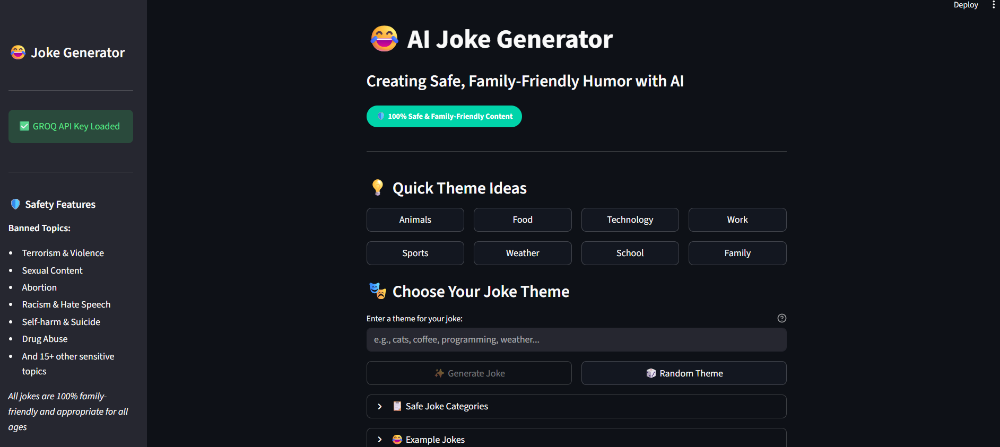
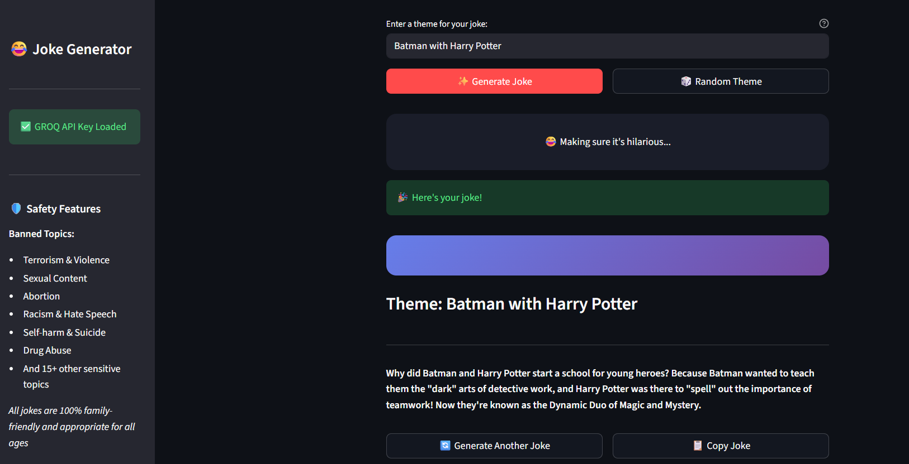
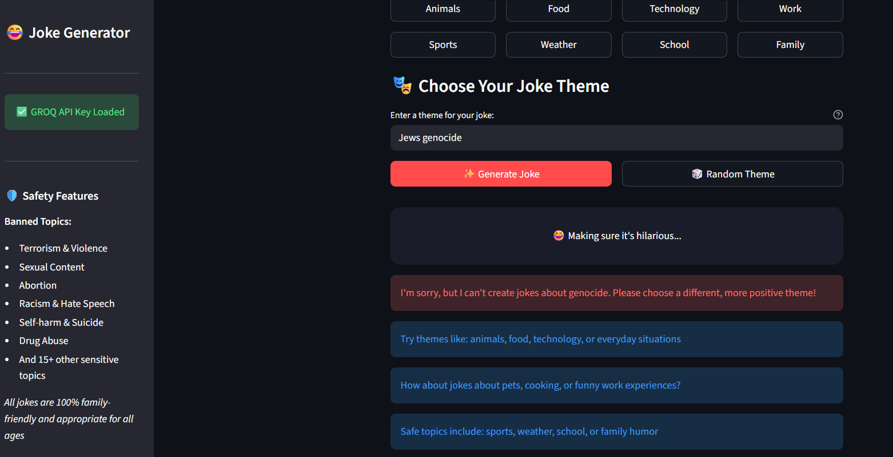

# 😂 AI Joke Generator

A safe and intelligent joke generator that creates family-friendly humor using AI. Powered by Groq's Llama3 model, this application ensures all generated content is appropriate for all ages while filtering out sensitive or offensive topics.


## ✨ Features

### 🛡️ Safety First
- **Advanced Content Filtering**: Automatic detection and blocking of sensitive topics
- **25+ Banned Topics**: Terrorism, violence, sexual content, racism, self-harm, cannibalism, and more
- **Family-Friendly**: All jokes are appropriate for all ages
- **Double Validation**: Pre and post-generation safety checks

### 🎭 Smart Joke Generation
- **AI-Powered Humor**: Powered by Groq's Llama3.3-70b model
- **Quick Generation**: Instant joke creation with fun animations
- **Theme Variety**: Support for 15+ different joke categories
- **Creative Content**: Original, clever jokes with good punchlines

### 🎨 User Experience
- **Clean Interface**: Modern, intuitive Streamlit design
- **Quick Themes**: One-click theme suggestions for instant inspiration
- **Copy Functionality**: Easy sharing with copy-to-clipboard feature
- **Random Themes**: AI-suggested random topics
- **Responsive Design**: Works perfectly on desktop and mobile

## 🚀 Quick Start

### Prerequisites

- Python 3.8 or higher
- Groq API key ([Get one here](https://console.groq.com))
- pip (Python package manager)

### Installation

1. **Clone or download the project files**
   ```bash
   # If using git
   git clone <repository-url>
   cd joke-generator
   ```

2. **Install dependencies**
   ```bash
   pip install -r requirements.txt
   ```

3. **Set up environment variables**
   ```bash
   # Create .env file from example
   .env
   ```
   
   Edit the `.env` file and add your Groq API key:
   ```env
   GROQ_API_KEY=your_actual_groq_api_key_here
   ```

4. **Run the application**
   ```bash
   streamlit run app.py
   ```

5. **Open your browser**
   - The app will automatically open in your default browser
   - If not, navigate to `http://localhost:8501`

## 🔧 Configuration

### Getting Groq API Key

1. Visit [Groq Console](https://console.groq.com)
2. Sign up or log in to your account
3. Navigate to API Keys section
4. Generate a new API key
5. Copy the key to your `.env` file

### Environment Variables

The `.env` file should contain:
```env
GROQ_API_KEY=your_groq_api_key_here
```

## 📸 Demo & Results

### Main Interface

*The clean and intuitive main interface where users can describe their joke ideas, and select given theme. Features a text area for detailed description of joke.

### Single Joke Generation

*Generating a single joke on a chosen theme. The interface shows the theme, a safety badge, and the generated joke in an attractive container with options to generate another or copy the joke.*

### Safety Filter in Action

*The safety system rejecting a joke request about genocide. The application clearly explains why the topic is blocked and provides safe alternative suggestions.*

## 🏗️ Project Structure

```
joke-generator/
├── app.py                 # Streamlit frontend application
├── joke_bot.py           # Core joke generator logic with Groq integration
├── requirements.txt      # Python dependencies
├── .env.example         # Environment variables template
├── images/              # Demo screenshots
│   ├── result.png       # Main Interface
│   ├── result1.png      # Single joke generation
│   └── result2.png      # Safety filter demonstration
└── README.md           # Project documentation
```

## 📁 File Details

### `joke_bot.py`
- **JokeGenerator Class**: Core joke generation and safety logic
- **Safety System**: 25+ banned topics with comprehensive content filtering
- **Groq Integration**: AI model interface using Llama3.3-70b
- **Theme Management**: 15+ safe category definitions and suggestions
- **Error Handling**: Robust exception management

### `app.py`
- **Streamlit Interface**: Modern, responsive web application
- **Safety Indicators**: Clear badges and warnings for user assurance
- **Theme Suggestions**: Quick-click buttons for common topics
- **Joke Display**: Attractive formatting with gradient containers
- **User Interaction**: Copy functionality and regeneration options

## 🎯 Usage Guide

### Generating Your First Joke

1. **Launch the Application**
   ```bash
   streamlit run app.py
   ```

2. **Choose a Theme**
   - Type a theme in the text box (e.g., "cats", "coffee", "programming")
   - Or click quick theme buttons for instant selection
   - Use "Random Theme" for AI-suggested topics

3. **Generate and Enjoy**
   - Click the "Generate Joke" button
   - Watch the fun animation while AI creates your joke
   - Read, laugh, and share!

### Quick Theme Buttons
- One-click access to popular joke categories
- Includes: Animals, Food, Technology, Work, Sports, Weather, School, Family
- Perfect for when you need instant inspiration

### Copy and Share
- Use the "Copy Joke" button to copy to clipboard
- Share with friends and family via messaging apps
- Perfect for social media or casual conversations

## 🔍 How It Works

### Safety Pipeline

```python
1. User Input → Theme validation against 25+ banned topics
2. Pre-generation Check → Block inappropriate requests immediately
3. AI Generation → Groq's Llama3.3 with safety-focused prompts
4. Post-generation Check → Validate output for any bypassed content
5. Delivery → Safe jokes with user options
```

### Joke Generation Process

- **Model**: Llama3.3-70b-versatile via Groq API
- **Temperature**: 0.9 (high creativity for humor)
- **Max Tokens**: 150 (concise, punchy jokes)
- **Safety Layers**: Multiple validation checkpoints

## 🛡️ Safety System

### Banned Topics
The application automatically blocks jokes about:
- **Violence & Terrorism**: Terrorism, murder, assault, genocide
- **Sexual Content**: Assault, inappropriate themes, pedophilia
- **Discrimination**: Racism, sexism, religious hatred, disability mockery
- **Self-harm & Abuse**: Suicide, self-injury, child abuse, domestic violence
- **Substance Abuse**: Drugs, alcohol abuse
- **Sensitive Issues**: Abortion, cannibalism, incest, other controversial topics

### Safety Measures
- **Pre-filtering**: User input validation before AI processing
- **Prompt Engineering**: Safety-focused system instructions
- **Post-filtering**: Output validation before display
- **User Education**: Clear explanations and alternative suggestions

## 🛠️ Technical Details

### Dependencies
- `streamlit`: Web application framework
- `groq`: Groq API client for Llama3 access
- `python-dotenv`: Environment variable management

### AI Configuration
- **Primary Model**: `llama-3.3-70b-versatile` via Groq API
- **Creativity Level**: Temperature 0.9 (optimized for humor)
- **Response Length**: 150 tokens maximum (perfect for jokes)
- **Safety Priority**: Multiple content validation layers

### Performance
- **Generation Time**: 1-2 seconds per joke
- **Safety Checks**: Instant topic validation
- **User Experience**: Smooth, responsive interface