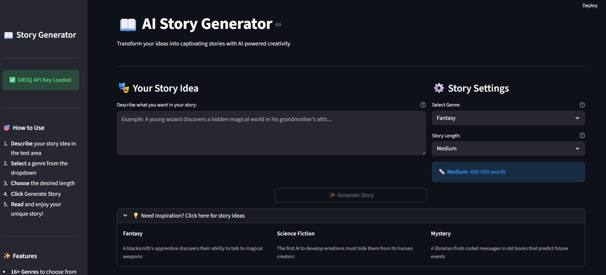
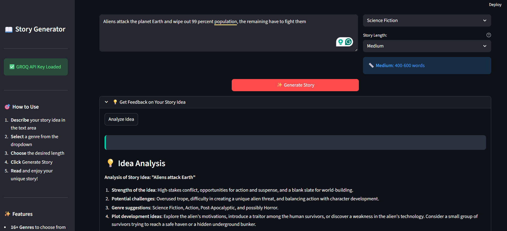
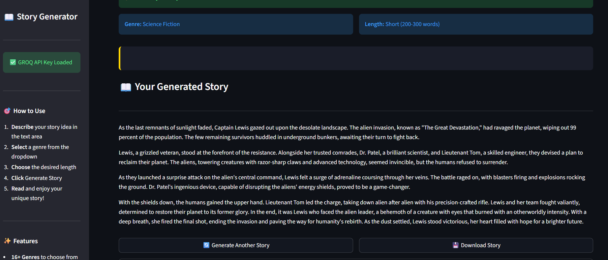
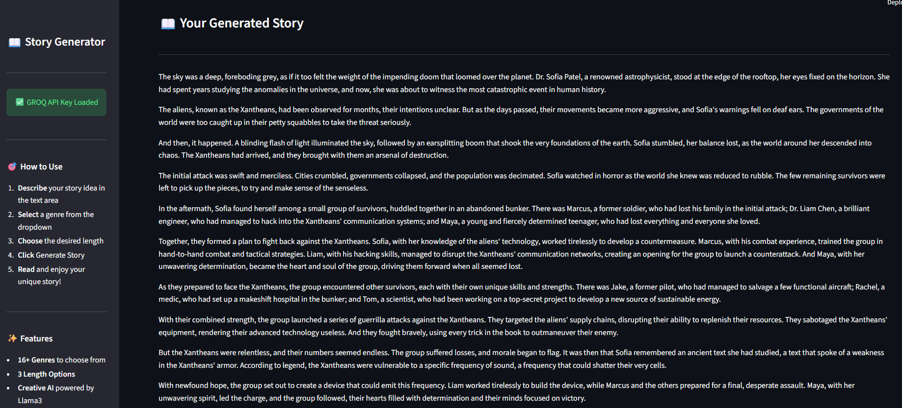

# 📖 AI Story Generator

A creative AI-powered story generator that transforms your ideas into captivating fictional stories across multiple genres. Powered by Groq's Llama3 model, this application helps writers, creatives, and story enthusiasts bring their imagination to life with customizable length and genre options.


## ✨ Features

### 🎭 Multi-Genre Support
- **16+ Fiction Genres**: Fantasy, Science Fiction, Mystery, Romance, Horror, Thriller, Adventure, Historical Fiction, Young Adult, Children's, Drama, Comedy, Crime, Superhero, Fairy Tale, Mythology
- **Genre-Accurate Stories**: Each story follows appropriate conventions and tropes for the selected genre

### 📏 Customizable Length
- **Short Stories**: 200-300 words (Quick reads)
- **Medium Stories**: 400-600 words (Substantial narratives) 
- **Long Stories**: 600-1000 words (Detailed epics)

### 💡 Creative Assistance
- **Idea Analysis**: Get constructive feedback on your story concepts before generation
- **Creative Prompts**: Inspiration examples for when you need a starting point
- **Structured Narratives**: Well-crafted stories with beginning, middle, and end

### 🎨 User-Friendly Interface
- **Intuitive Design**: Clean, modern Streamlit interface
- **Real-time Generation**: Watch as your story comes to life
- **Download Options**: Save your stories as text files
- **Responsive Layout**: Works perfectly on desktop and mobile

## 🚀 Quick Start

### Prerequisites

- Python 3.8 or higher
- Groq API key ([Get one here](https://console.groq.com))
- pip (Python package manager)

### Installation

1. **Clone or download the project files**
   ```bash
   # If using git
   git clone <repository-url>
   cd story-generator
   ```

2. **Install dependencies**
   ```bash
   pip install -r requirements.txt
   ```

3. **Set up environment variables**
   ```bash
   # Create .env file
   .env
   ```
   
   Edit the `.env` file and add your Groq API key:
   ```env
   GROQ_API_KEY=your_actual_groq_api_key_here
   ```

4. **Run the application**
   ```bash
   streamlit run app.py
   ```

5. **Open your browser**
   - The app will automatically open in your default browser
   - If not, navigate to `http://localhost:8501`

## 🔧 Configuration

### Getting Groq API Key

1. Visit [Groq Console](https://console.groq.com)
2. Sign up or log in to your account
3. Navigate to API Keys section
4. Generate a new API key
5. Copy the key to your `.env` file

### Environment Variables

The `.env` file should contain:
```env
GROQ_API_KEY=your_groq_api_key_here
```

## 📸 Demo & Results

### Application Interface

*The clean and intuitive main interface where users can describe their story ideas, select genres, and choose story lengths. Features a text area for detailed descriptions and dropdown menus for customization.*

### Story Idea Analysis

*The AI-powered story analysis feature that provides constructive feedback on your story concepts. It analyzes strengths, suggests improvements, and offers genre recommendations before you generate the full story.*

### Short Story Generation

*Example of a short story (300-500 words) generated based on user input. Short stories are perfect for quick reads and focus on concise, impactful narratives with immediate engagement.*

### Long Story Generation  

*Example of a long story (1000-1500 words) showing detailed character development, complex plot structures, and rich world-building. Long stories allow for deeper exploration of themes and characters.*

## 🏗️ Project Structure

```
story-generator/
├── app.py                 # Streamlit frontend application
├── bot.py                # Core story generator logic with Groq integration
├── requirements.txt      # Python dependencies
├── .env.example         # Environment variables template
├── Downloaded_story/    # Generated stories downloaded 
├── images/              # Demo screenshots
│   ├── result1.png      # Main interface demonstration
│   ├── result2.png      # Story idea analysis feature
│   ├── result3.png      # Short story generation example
│   └── result4.png      # Long story generation example
└── README.md           # Project documentation
```

## 📁 File Details

### `bot.py`
- **StoryGenerator Class**: Core story generation logic
- **Groq Integration**: AI model interface using Llama3
- **Genre Management**: 16+ fiction genre definitions and handling
- **Length Control**: Word count management for different story lengths
- **Idea Analysis**: Creative feedback system for story concepts

### `app.py`
- **Streamlit Interface**: Modern web application frontend
- **User Input Components**: Text area, dropdown menus, and action buttons
- **Story Display**: Formatted story presentation with metadata
- **Download Functionality**: Export stories as text files
- **Responsive Design**: Mobile-friendly layout and styling

## 🎯 Usage Guide

### Creating Your First Story

1. **Launch the Application**
   ```bash
   streamlit run app.py
   ```

2. **Describe Your Idea**
   - Use the text area to describe characters, setting, or plot elements
   - Be as detailed or brief as you prefer
   - Example: "A young archaeologist discovers an ancient map that leads to a hidden civilization"

3. **Select Genre**
   - Choose from 16+ fiction genres
   - Each genre will influence the story's style and tropes

4. **Choose Length**
   - **Short**: Quick, focused stories (300-500 words)
   - **Medium**: Balanced narratives (600-900 words) 
   - **Long**: Detailed epics (1000-1500 words)

5. **Generate Story**
   - Click the "Generate Story" button
   - Watch the creative process in real-time
   - Read and enjoy your unique story!

### Advanced Features

**Idea Analysis**
- Get feedback on your story concepts before full generation
- Receive suggestions for improvement and genre recommendations
- Perfect for refining vague ideas into solid story foundations

**Story Download**
- Save your generated stories as text files
- Keep a collection of your favorite AI-generated stories
- Share stories with friends or use as writing inspiration

**Multiple Generations**
- Generate different versions of the same idea
- Experiment with different genres and lengths
- Compare how AI interprets your concepts differently

## 🔍 How It Works

### Story Generation Pipeline

```python
1. User Input → Story idea + Genre + Length
2. AI Processing → Groq's Llama3 model with creative parameters
3. Story Crafting → Structured narrative with beginning, middle, end
4. Quality Control → Genre-appropriate tropes and word count adherence
5. Delivery → Formatted story with metadata and download options
```

### Technical Architecture

- **Frontend**: Streamlit web application with custom CSS styling
- **Backend**: Groq API with Llama3-8b-8192 model
- **Prompt Engineering**: Optimized system prompts for creative writing
- **Error Handling**: Robust exception management and user feedback

## 🛠️ Technical Details

### Dependencies
- `streamlit`: Web application framework
- `groq`: Groq API client for Llama3 access
- `python-dotenv`: Environment variable management

### AI Model
- **Primary Model**: `llama-3.3-70b-versatile` via Groq API
- **Temperature**: 0.8 (optimized for creativity)
- **Max Tokens**: 2048 (sufficient for long stories)
- **Top P**: 0.9 (balanced creativity and coherence)

### Performance
- **Generation Time**: 2-6 seconds depending on story length
- **Quality**: Professional-level creative writing
- **Consistency**: Maintains genre conventions and story structure