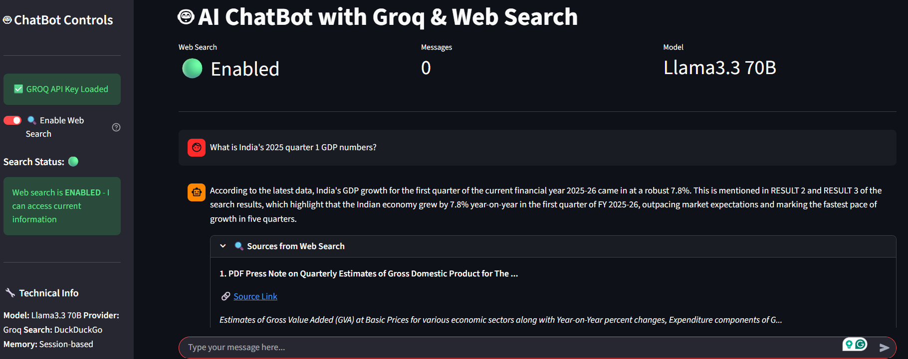
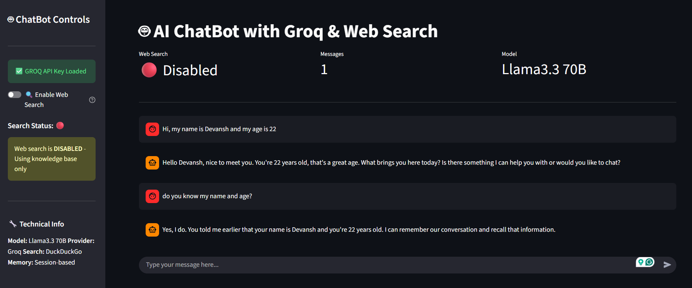

# 🤖 AI ChatBot with Groq & Web Search

A sophisticated AI-powered chatbot that combines the power of Groq's Llama3 model with real-time internet search capabilities. This chatbot maintains conversation memory and provides source citations for web searches, offering a comprehensive and intelligent chatting experience.


## ✨ Features

### 🤖 Smart AI Conversations
- **Llama3.3 70B Model**: Powered by Groq's ultra-fast inference engine
- **Contextual Understanding**: Maintains conversation context and memory
- **Natural Responses**: Human-like conversational abilities

### 🔍 Real-time Web Search
- **DuckDuckGo Integration**: Access to current information and news
- **Toggle Search**: Enable/disable web search anytime during conversation
- **Source Citations**: Clickable URLs and search result snippets
- **Verified Information**: Ground responses in real-world data

### 💾 Advanced Features
- **Conversation Memory**: Remembers context across multiple exchanges
- **Export Conversations**: Download chat history as JSON
- **Session Management**: Clear and restart conversations easily
- **Responsive UI**: Clean, modern Streamlit interface

## 🚀 Quick Start

### Prerequisites

- Python 3.8 or higher
- Groq API key ([Get one here](https://console.groq.com))
- pip (Python package manager)

### Installation

1. **Clone or download the project files**
   ```bash
   # If using git
   git clone <repository-url>
   cd ai-chatbot-groq
   ```

2. **Install dependencies**
   ```bash
   pip install -r requirements.txt
   ```

3. **Set up environment variables**
   ```bash
   # Create .env file from example
   cp .env.example .env
   ```
   
   Edit the `.env` file and add your Groq API key:
   ```env
   GROQ_API_KEY=your_actual_groq_api_key_here
   ```

4. **Run the application**
   ```bash
   streamlit run app.py
   ```

5. **Open your browser**
   - The app will automatically open in your default browser
   - If not, navigate to `http://localhost:8501`

## 🔧 Configuration

### Getting Groq API Key

1. Visit [Groq Console](https://console.groq.com)
2. Sign up or log in to your account
3. Navigate to API Keys section
4. Generate a new API key
5. Copy the key to your `.env` file

### Environment Variables

The `.env` file should contain:
```env
GROQ_API_KEY=your_groq_api_key_here
```

## 📸 Demo & Results

### Internet Search Feature

*The chatbot performing real-time web search with source citations. When search is enabled, it fetches current information from DuckDuckGo and displays clickable source URLs.*

### Conversation Memory

*Demonstration of the chatbot's memory capabilities. It maintains context across multiple exchanges and remembers previous parts of the conversation.*

## 🏗️ Project Structure

```
chatbot/
├── app.py                 # Streamlit frontend application
├── chatbot.py            # Core chatbot logic with Groq integration
├── requirements.txt      # Python dependencies
├── images/              # Demo screenshots
│   ├── result1.png      # Web search demonstration
│   └── result2.png      # Conversation memory demonstration
└── README.md           # Project documentation
```

## 📁 File Details

### `chatbot.py`
- **GroqChatBot Class**: Main chatbot logic
- **Web Search Integration**: DuckDuckGo search functionality
- **Memory Management**: Conversation history handling
- **Response Generation**: AI response processing with Groq API

### `app.py`
- **Streamlit Interface**: Web application frontend
- **UI Components**: Chat interface, sidebar controls, source display
- **Session Management**: State handling and conversation flow
- **Source Rendering**: Display of search results and URLs

## 🎯 Usage Guide

### Starting a Conversation
1. Launch the application with `streamlit run app.py`
2. Ensure your Groq API key is properly set in the `.env` file
3. The chatbot is ready to receive messages in the main chat interface

### Using Web Search
1. **Toggle Search**: Use the switch in the sidebar to enable/disable web search
2. **Ask Questions**: When search is enabled, the chatbot will fetch current information
3. **View Sources**: Click on the expander below responses to see source URLs and snippets

### Managing Conversations
- **Clear History**: Use the "Clear History" button to start a new conversation
- **Export Chat**: Download the entire conversation as JSON for later reference
- **Toggle Features**: Enable/disable web search anytime without interrupting the flow

## 🔍 How It Works

### Architecture
1. **User Input**: Messages are processed through the Streamlit interface
2. **Search Integration**: When enabled, DuckDuckGo searches for relevant information
3. **AI Processing**: Groq's Llama3 model generates contextual responses
4. **Memory Management**: Conversation history is maintained for context
5. **Response Delivery**: Formatted responses with sources are displayed to the user

### Search Flow
```python
# When search is enabled:
1. User query → DuckDuckGo search
2. Results processed → Titles, URLs, snippets extracted
3. Context sent to Groq → AI generates informed response
4. Response + Sources → Displayed to user with clickable links
```

## 🛠️ Technical Details

### Dependencies
- `streamlit`: Web application framework
- `groq`: Groq API client for Llama3 access
- `duckduckgo-search`: Web search functionality
- `requests`: HTTP requests for web content
- `beautifulsoup4`: HTML parsing
- `python-dotenv`: Environment variable management

### Models Used
- **Primary Model**: `llama3.3-70b-versatile` via Groq API
- **Search Engine**: DuckDuckGo
- **Response Format**: Markdown with source citations