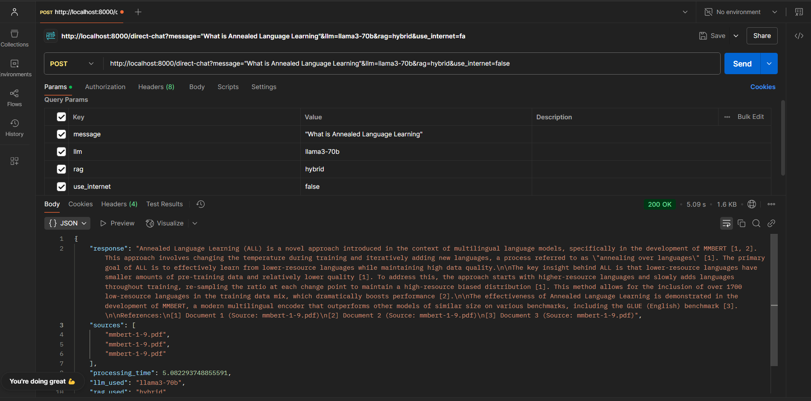

# Multi-Modal RAG Chatbot - Backend

A sophisticated backend API for a Multi-Modal Retrieval-Augmented Generation (RAG) chatbot that supports text documents, PDFs, and images with multiple LLM options and advanced RAG strategies.

## 🚀 Features

- **Multi-Modal Support**: Process text files, PDFs, Word documents, and images (OCR)
- **Multiple LLM Integration**: Support for state-of-the-art language models via Groq API
- **Advanced RAG Strategies**: Three distinct RAG variants with different retrieval mechanisms
- **Internet Search**: Real-time web search integration using DuckDuckGo
- **Vector Storage**: Hybrid retrieval using Pinecone for dense vectors and BM25 for sparse vectors
- **Knowledge Graphs**: Graph-based RAG using NetworkX for relationship extraction
- **Document Management**: Comprehensive document upload, listing, and management

## 🏗️ Architecture

### Retrieval Systems
- **Dense Vector Retrieval**: Pinecone vector database for semantic similarity search
- **Sparse Vector Retrieval**: BM25 encoder for keyword-based traditional search
- **Hybrid Approach**: Combines both dense and sparse retrieval for optimal results

### RAG Variants
- **Vanilla RAG**: Basic retrieval and generation with hybrid vector search
- **Knowledge Graph RAG**: Enhanced with NetworkX graph relationships
- **Hybrid RAG**: Combines multiple retrieval strategies for comprehensive answers

### Search Integration
- **DuckDuckGo Search**: Real-time internet information retrieval
- **Optional Integration**: Enable/disable based on query requirements

## 📁 Project Structure

```
backend/
├── app/
│   ├── __init__.py
│   ├── main3.py                 # FastAPI application & endpoints
│   ├── config.py              # Configuration settings
│   ├── models/
│   │   └── models.py          # Pydantic models & data structures
│   ├── services/
│   │   ├── document_processor.py  # Multi-modal document processing
│   │   ├── internet_search.py     # DuckDuckGo search integration
│   │   ├── llm_service.py         # Groq API LLM integration
│   │   ├── rag_service.py         # RAG strategy implementations
│   │   └── vector_store.py        # Pinecone & BM25 vector management
│   └── utils/
│       └── observability.py       # Monitoring & logging setup
├── images/                    # Demo result images
│   ├── result1.png           # Document upload success
│   ├── result2.png           # PDF Q&A with Llama3 + Hybrid RAG
│   ├── result3.png           # Out-of-scope question (internet off)
│   ├── result4.png           # Same question answered (internet on)
│   ├── result5.png           # Internet search with Vanilla RAG
│   ├── result6.png           # PDF summarization with GPT-OSS
│   ├── result8.png           # Image upload with document count
│   ├── result9.png           # Image OCR name extraction
│   ├── result10.png          # Document list retrieval
│   └── result11.png          # Document deletion
├── requirements.txt          # Python dependencies
├── .env                      # Environment variables
└── README.md                 # This file
```

## 🔌 API Integrations

### LLM Provider
- **Groq API**: High-performance inference for all language models
- **Supported Models**:
  - `llama2-70b` → `llama2-70b-4096`
  - `gpt-oss-120b` → `openai/gpt-oss-120b` 
  - `gemma-7b` → `gemma-7b-it`
  - `llama3-70b` → `llama-3.3-70b-versatile`

### Vector Database
- **Pinecone**: Managed vector database for dense embeddings
- **BM25**: Traditional sparse vector retrieval

### Additional Services
- **DuckDuckGo**: Internet search functionality
- **NetworkX**: Knowledge graph construction and traversal

## 📋 API Endpoints

### Chat Endpoints
| Endpoint | Method | Description |
|----------|--------|-------------|
| `/chat` | POST | Chat with JSON request body |
| `/direct-chat` | POST | Direct chat with query parameters |

### Document Management
| Endpoint | Method | Description |
|----------|--------|-------------|
| `/upload` | POST | Upload document via file upload |
| `/direct-upload` | POST | Upload document via file path |
| `/documents` | GET | List all uploaded documents |
| `/documents` | DELETE | Clear all documents |

### System Endpoints
| Endpoint | Method | Description |
|----------|--------|-------------|
| `/health` | GET | Basic health check |
| `/` | GET | API documentation and information |

## 🛠️ Installation & Setup

### Prerequisites
- Python 3.8+
- Groq API account and key
- Pinecone account for vector storage
- Required environment variables in `.env`

### Environment Setup
Create a `.env` file with:
```env
GROQ_API_KEY=your_groq_api_key_here
PINECONE_API_KEY=your_pinecone_api_key_here
PINECONE_ENVIRONMENT=your_pinecone_environment
PINECONE_INDEX_NAME=your_index_name
```

### Installation
```bash
# Clone the repository
git clone <repository-url>
cd backend

# Install dependencies
pip install -r requirements.txt

# Start the server
python -m app.main3 serve
```

### Running the Server
```bash
# Default settings (localhost:8000)
python -m app.main3 serve

# Custom configuration
python -m app.main3 serve --host 0.0.0.0 --port 8000
```

## 🤖 Available LLM Models

| Model Name | API Identifier | Groq Model | Description |
|------------|----------------|------------|-------------|
| **Llama 2 70B** | `llama2-70b` | `llama2-70b-4096` | High-capacity model for complex tasks |
| **GPT OSS 120B** | `gpt-oss-120b` | `openai/gpt-oss-120b` | Largest open-source model |
| **Gemma 7B** | `gemma-7b` | `gemma-7b-it` | Efficient and fast inference |
| **Llama 3 70B** | `llama3-70b` | `llama-3.3-70b-versatile` | Latest versatile model |

## 🔧 Configuration Options

### RAG Variants
- **`vanilla`**: Hybrid retrieval (Pinecone + BM25) with basic generation
- **`knowledge_graph`**: NetworkX-based relationship extraction and reasoning
- **`hybrid`**: Combines multiple retrieval strategies for optimal performance

### Search Features
- **Internet Search**: Enable with `use_internet=true` parameter
- **Multi-modal Processing**: Automatic text extraction from images via OCR

### Supported File Types
- **Text**: `.txt`
- **Documents**: `.pdf`, `.docx`
- (images**: `.jpg`, `.jpeg`, `.png` (with OCR text extraction)

## 📖 Usage Examples

### Using cURL

#### 1. Upload Documents
```bash
# Upload PDF via file path
curl -X POST "http://localhost:8000/direct-upload?file_path=/path/to/research.pdf"

# Upload image with OCR
curl -X POST "http://localhost:8000/direct-upload?file_path=/path/to/diagram.png"
```

#### 2. Chat with Different Configurations
```bash
# Knowledge Graph RAG with Llama 3
curl -X POST "http://localhost:8000/direct-chat?message=Explain the relationships in the document&llm=llama3-70b&rag=knowledge_graph"

# Hybrid RAG with internet search using GPT OSS
curl -X POST "http://localhost:8000/direct-chat?message=Latest developments in AI&llm=gpt-oss-120b&rag=hybrid&use_internet=true"

# Vanilla RAG with Gemma for quick answers
curl -X POST "http://localhost:8000/direct-chat?message=Summarize the main points&llm=gemma-7b&rag=vanilla"
```

#### 3. Document Management
```bash
# List all uploaded documents
curl http://localhost:8000/documents

# Clear document database
curl -X DELETE http://localhost:8000/documents
```

### Using Postman

#### Direct Chat Configuration
- **Method**: POST
- **URL**: `http://localhost:8000/direct-chat`
- **Query Parameters**:
  - `message`: Your question or prompt
  - `llm`: `llama2-70b` | `gpt-oss-120b` | `gemma-7b` | `llama3-70b`
  - `rag`: `vanilla` | `knowledge_graph` | `hybrid`
  - `use_internet`: `true` | `false`

#### File Upload
- **Method**: POST
- **URL**: `http://localhost:8000/upload`
- **Body**: form-data
  - Key: `file` → Select File → Choose document/image

## 📊 Demo Results & Capabilities

### Document Processing & Management

**Successful document upload via Postman interface**

**Multi-modal support showing image upload with 2 total documents**

**Comprehensive document information retrieval**

**Efficient document clearance and management**

### Intelligent Chat Responses

**Context-aware answers from PDF using Llama 3 with Hybrid RAG**

**PDF summarization using GPT OSS 120B with Vanilla RAG**

**Advanced OCR capabilities extracting names from images**

### Internet Search Integration

**Controlled responses when question is outside document scope (internet disabled)**

**Enhanced answers using DuckDuckGo search integration**

**Internet search combined with Vanilla RAG strategy**

## 🎯 Technical Highlights

### Vector Retrieval System
- **Pinecone Integration**: High-performance dense vector similarity search
- **BM25 Encoder**: Traditional sparse vector retrieval for keyword matching
- **Hybrid Scoring**: Intelligent combination of both retrieval methods

### Knowledge Graph Capabilities
- **NetworkX Integration**: Graph-based relationship extraction and reasoning
- **Entity Relationship Mapping**: Automatic discovery of connections in documents
- **Graph Traversal**: Advanced querying through knowledge graphs

### Multi-Modal Processing
- **Text Extraction**: Advanced OCR for image content processing
- **Format Agnostic**: Unified processing pipeline for all document types
- **Content Chunking**: Intelligent document segmentation for optimal retrieval

## 🔍 API Response Formats

### Chat Response
```json
{
  "response": "Comprehensive AI-generated answer with citations",
  "sources": ["document.pdf - page 3", "research.txt - section 2.1"],
  "processing_time": 3.2,
  "llm_used": "llama3-70b",
  "rag_used": "knowledge_graph",
  "internet_search": true,
  "available_documents": 3
}
```

### Upload Response
```json
{
  "message": "Document processed and indexed successfully",
  "document_id": "uuid-1234-5678",
  "chunks_processed": 24,
  "file_name": "research.pdf",
  "available_documents_count": 5
}
```

## 🚦 System Monitoring

### Health Check
```bash
curl http://localhost:8000/health
```
Response:
```json
{
  "status": "healthy",
  "service": "Multi-Modal RAG Chatbot",
  "documents_available": 3
}
```

### API Documentation
Access comprehensive documentation at:
```
http://localhost:8000
```

## 📝 Best Practices

### Model Selection Guide
- **Complex Analysis**: Use `gpt-oss-120b` or `llama3-70b`
- **Quick Responses**: Use `gemma-7b` for faster inference
- **Balanced Performance**: `llama2-70b` for general purposes

### RAG Strategy Recommendations
- **Structured Documents**: `knowledge_graph` for technical papers
- **General Content**: `hybrid` for mixed content types
- **Simple Q&A**: `vanilla` for straightforward queries

### Internet Search Usage
- Enable for current events or external knowledge
- Disable for document-specific queries to ensure focused responses